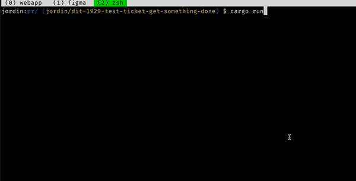

**pr** (name tbd) helps you quickly create ✨high context✨ pull requests from the command line.



## Current features

Run a single command to automatically infer a bunch of useful information to be included in a PR, then automagically open it up on GitHub -- all without having to leave your terminal.

- Accepts target branch for PR as argument or automatically chooses `main` / `master` according to how current repository is configured
- Parses current branch name for "DIT-XXX" pattern; if matched, use pattern to query Linear ticket information from Linear API
- If Linear ticket is found:
  > - Auto-populates PR title following pattern "[DIT-XXX] {Linear ticket name}"
  > - Auto-populates `Context` section of PR body with Linear ticket description
- Auto-populates `Overview` section of PR body with chronologically ordered commits that exist in current branch but don't exist in the target branch
- In the style of `git commit`:
  > - Opens generated PR title in default system `$EDITOR` (e.g. vim) forediting before submitting
  > - Opens generated PR body in default system `$EDITOR` (e.g. vim) for editing before submitting

## Requirements

- `git` installed
- [gh](https://cli.github.com/) installed and authenticated

## Installation

lol homebrew or somethin?

if you want to use this right now you'll install the Rust toolchain stuff, clone the repo, run `cargo build`, then symlink the binary somewhere in your `$PATH` - sounds like a nightmare.

WIP:

```
curl -LO https://raw.githubusercontent.com/azjgard/pr/main/bin/install.sh && sudo chmod +x ./install.sh && sudo ./install.sh && rm ./install.sh
```

## Usage

Current working directory must..

- be a git repo
- have a remote called `origin`
- have an `.env` file in with `LINEAR_API_KEY` specified in it:

```
LINEAR_API_KEY=lin_api_xxxxx
```

Then it's ez!

```
# automatically open PR for current branch
pr

# automatically open PR for explicit target
pr some/target/branch
```

## TODOS

- [ ] Help menu
- [ ] Support selecting list of recent screenshots (+gifs?) in screenshot directory to include in PR body
  > - Upload as attachments to [Linear ticket](https://developers.linear.app/docs/graphql/attachments), [Jira ticket](https://confluence.atlassian.com/jirakb/how-to-add-an-attachment-to-a-jira-issue-using-rest-api-699957734.html) or some other custom specified source, and then use the links generated from there to include in PR markup.
- [ ] Support for parsing project management ticket identifier patterns from commit messages to associate multiple tickets with a single PR.
- [ ] Support reading from a configuration file:
  > - PR title template
  > - PR body template
  > - Default target branch for PRs
  > - Settings for project management integration (Linear versus Jira versus etc)
  > - Regex for parsing project management ticket identifier
- [ ] Tests
- [ ] Refactor all my garbo code
- [ ] Multithread or something? idk

## Motivation

Two reasons for creating this:

1. It's a tool I've been craving because I spend an excessive amount of time writing PR descriptions and creating a network of backlinks between GitHub, Linear, and Slack to make things easier to refer to later.
2. I wanted a simple starter project to learn Rust with -- everyone is talking about it and I got FOMO.
